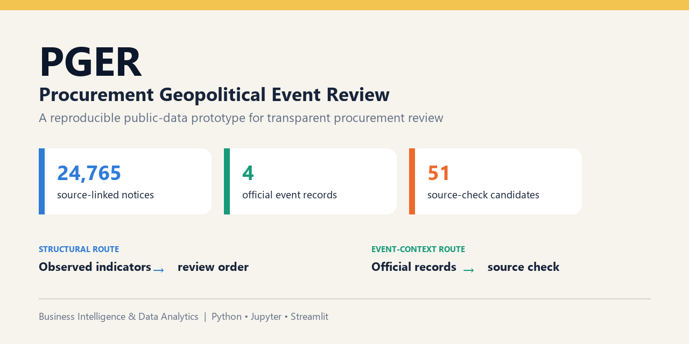
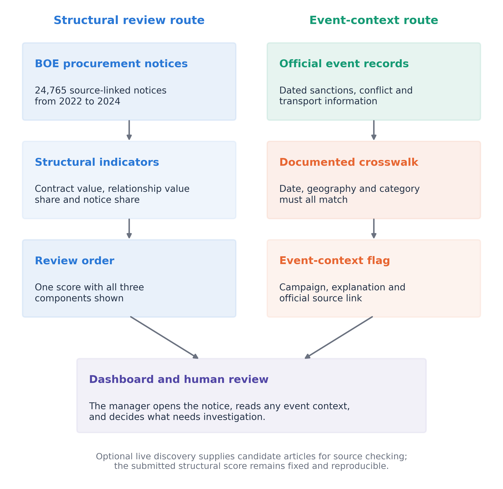
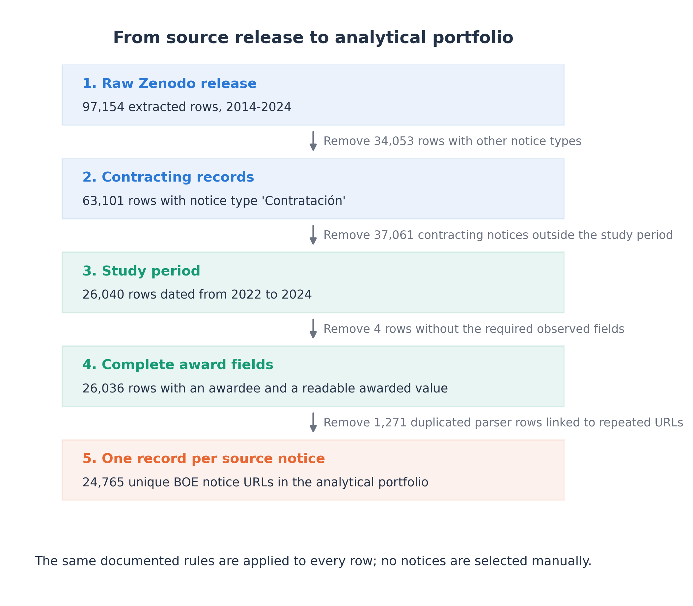
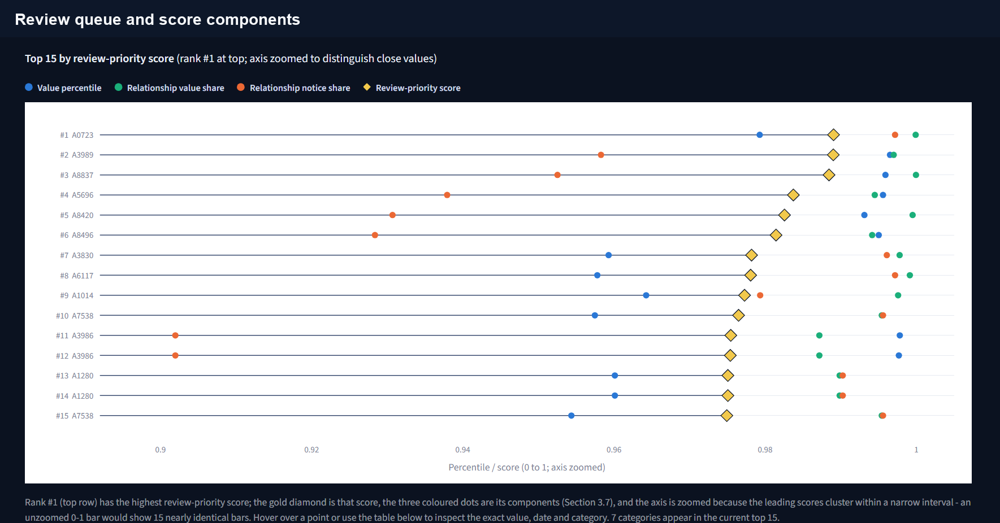
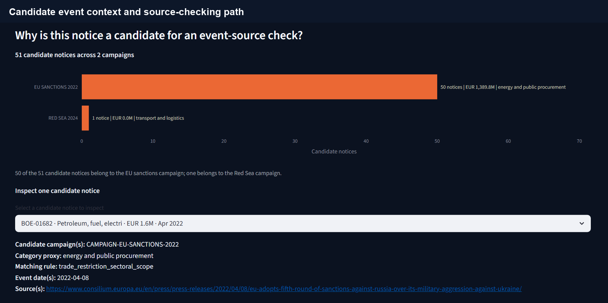

# Procurement Geopolitical Event Review (PGER)

[](https://github.com/hamzatebri/PGER-public-data-prototype/actions/workflows/validate.yml)
[](https://www.python.org/)
[](notebook/Hamza_Tebri_PGER_TFG_End_to_End.ipynb)
[](dashboard/dashboard.py)
[](LICENSE)



PGER is a Business Intelligence and Data Analytics project that turns public procurement data into a transparent review workflow. It helps a reviewer decide which contracting notices to inspect first and which official external source to open when relevant geopolitical context is available.

The project has two deliberately separate routes. The structural route orders notices using observed procurement indicators. The event-context route links dated official records to potentially relevant notices and asks a human reviewer to check the source before acting.

| Start here | Purpose |
|---|---|
| [Executed end-to-end notebook](notebook/Hamza_Tebri_PGER_TFG_End_to_End.ipynb) | Follow the complete data journey, calculations, visuals and interpretation |
| [Streamlit dashboard](dashboard/dashboard.py) | Explore the review queue and source-linked event context |
| [Source register](docs/SOURCE_REGISTER.md) | Check provenance, dates, scope and reproducibility records |
| [Evidence policy](docs/EVIDENCE_POLICY.md) | See how observed data, derived measures and external context are separated |

## Project at a glance

Public contracting records contain useful evidence, but their scale makes manual review difficult. PGER provides a reproducible way to clean those records, compare notices on the same scale and keep the reason behind each review position visible.

The main portfolio comes from the Spanish public-procurement records retained in this project as the BOE dataset. The source contains notices published through Spain's official state gazette. PGER narrows the data to 2022-2024, retains notices with a named awardee and an awarded value, removes repeated source links and creates one analytical record per published notice.

| Verified item | Frozen result |
|---|---:|
| Raw source rows | 97,154 |
| Eligible rows before duplicate-link removal | 26,036 |
| Duplicate source rows removed | 1,271 |
| Unique published notices in the final portfolio | 24,765 |
| Normalised awardee display IDs | 8,959 |
| Total published notice value | EUR 29.18 billion |
| Official external-event records | 4 |
| Notices linked to candidate event context at the selected 180-day window | 51 |

## Two transparent review routes



The blue route creates the structural review order from three visible indicators. It is always available because it depends only on the frozen procurement portfolio. The green route begins with a dated official record, applies documented date, geography and category rules, and opens the original source for human checking.

The event match does not change the structural score. This design avoids converting a broad geopolitical report into an unsupported claim about one awardee, while still making relevant public context useful in the review process.

## What the analysis found

**A reproducible portfolio can be built from a much larger source.** The cleaning process reduced 97,154 raw rows to 24,765 unique, source-linked notices that meet the declared scope. Each retained row keeps its original source URL, awardee, contracting authority, category, date and published value.

**The score produces a smaller upper review band, but its weights matter.** The baseline 50/30/20 configuration places 2,683 notices in the `Priority review` band. An equal-weight scenario has a Spearman rank correlation of 0.959 with the baseline, yet only seven of the same ten notices remain in the top ten. The dashboard shows each score component so a reviewer can understand this ordering. A company pilot would be needed to establish whether the resulting workload is manageable in practice.

**Official events provide focused context rather than a second risk score.** At the selected 180-day window, the documented crosswalk links 51 distinct notices to candidate context: 50 to the 2022 European Union sanctions campaign and one to the Red Sea campaign. The Panama Canal campaign produces no match at this window. These results show exactly where the current rules find a connection and where they do not.

**The practical output is a review path.** A reviewer can start with a structurally important notice, inspect the factors behind its position, check whether official context is attached and open the original source. PGER therefore supports evidence checking and prioritisation without presenting the score as a disruption probability.

## Data journey



The funnel records every major reduction from the downloaded source to the analytical portfolio. The steps are implemented in the notebook and reusable scripts, while the source register records the exact release and resulting files.

## Dashboard preview

| Structural review queue | Event-context route |
|---|---|
|  |  |
| Compare the highest review positions and see how the three components contribute to each score. | Inspect the campaign, matching rule, date window and original official source before deciding whether the notice needs attention. |

## How the structural score works

Each component is converted to a percentile from 0 to 1 so that different measures can be combined on the same scale.

```text
review-priority score =
    0.50 x contract-value percentile
  + 0.30 x authority-awardee value-share percentile
  + 0.20 x authority-awardee notice-share percentile
```

The first component identifies relatively large notices. The second measures how much of a contracting authority's observed awarded value is linked to the awardee. The third measures the awardee's share of that authority's observed notices. The resulting number is a transparent ordering measure for this portfolio, not a probability that an awardee or contract will fail.

| Score | Review band |
|---:|---|
| Above 0.80 | Priority review |
| Above 0.50 up to and including 0.80 | Focused review |
| Up to and including 0.50 | Routine review |

## Repository map

| Path | What it contains |
|---|---|
| [`notebook/`](notebook/) | One executed notebook covering ingestion, cleaning, transformation, analysis, visualisation, live-source checks and dashboard launch |
| [`dashboard/`](dashboard/) | Streamlit review interface and Windows launcher |
| [`src/`](src/) | Reusable data, scoring, event-matching, sensitivity, discovery and validation scripts |
| [`data/processed/`](data/processed/) | Frozen files used by the notebook, dashboard and figures |
| [`data/raw/external_evidence/`](data/raw/external_evidence/) | Retained official records used by the frozen event registry |
| [`data/evaluation/`](data/evaluation/) | Researcher-labelled development material for the local-model feasibility exercise |
| [`docs/`](docs/) | Source register, evidence rules, event crosswalk and audit records |
| [`figures/`](figures/) | Current analytical figures and dashboard views |
| [`tests/`](tests/) | Automated checks for scope, scoring, matching, notebook execution and public-package safety |

## Run the dashboard

Python 3.11 or newer is recommended.

```powershell
git clone https://github.com/hamzatebri/PGER-public-data-prototype.git
cd PGER-public-data-prototype
python -m venv .venv
.\.venv\Scripts\Activate.ps1
python -m pip install -r requirements.txt
python -m streamlit run dashboard/dashboard.py
```

Open `http://localhost:8501` if the browser does not open automatically. The dashboard reads the committed processed evidence, so the large raw BOE file and private API keys are not required for this route.

## Reproduce from the raw source

The large raw CSV is not committed to GitHub. The downloader retrieves the exact Version 3 file from [Zenodo](https://zenodo.org/records/18712463) and checks it against the published file information before the pipeline reads it.

```powershell
python src/download_boe_dataset.py
python src/build_portfolio.py
python src/score_portfolio.py
python src/match_events_to_portfolio.py
python src/analyse_sensitivity.py
python src/generate_source_audit.py
python src/make_sensitivity_figure.py
python src/execute_notebook.py
python -m pytest -q
```

The [executed notebook](notebook/Hamza_Tebri_PGER_TFG_End_to_End.ipynb) provides the easiest way to review the full process and its outputs. To rebuild it after reproducing the data, run `python src/build_end_to_end_notebook.py` and execute the resulting notebook from top to bottom.

## Supplementary APIs and local model

The optional live-discovery demonstration searches recent reports, compares provider coverage and assigns candidate titles to a simple event family for human review. These services do not feed `score_portfolio.py` and do not change the frozen structural score or thesis findings.

| Service | What it provides | How PGER uses it | Local setting |
|---|---|---|---|
| [Tavily Search API](https://docs.tavily.com/documentation/api-reference/endpoint/search) | Web results with a title and source URL | Runs the three fixed event-family searches and retains up to three candidates per query | `TAVILY_API_KEY` |
| [The Guardian Open Platform](https://open-platform.theguardian.com/documentation/search) | Searchable Guardian article metadata | Requests recent results and retains up to three candidates per query | `GUARDIAN_API_KEY` |
| [NewsAPI Everything](https://newsapi.org/docs/endpoints/everything) | Article metadata from multiple publishers | Searches by the same fixed queries and publication date | `NEWSAPI_KEY` |
| [GNews Search API](https://docs.gnews.io/endpoints/search-endpoint) | News titles, dates and URLs | Retains up to three candidates per query | `GNEWS_API_KEY` |
| [NewsData.io Latest News API](https://newsdata.io/documentation) | Recent English-language article metadata | Adds recent candidates from a further provider | `NEWSDATA_API_KEY` |
| [GDELT DOC 2.0 API](https://blog.gdeltproject.org/gdelt-doc-2-0-api-debuts/) | Credential-free global news search | Runs a separate low-volume health query and reuses its result for 24 hours | No key required |
| [LM Studio local API](https://lmstudio.ai/docs/developer/rest) | Local model inference through an OpenAI-compatible interface | Sends deduplicated candidate titles to `openai/gpt-oss-20b` and requests one structured event-family label | `LM_STUDIO_BASE_URL` and `LM_STUDIO_MODEL` |

`src/live_evidence_discovery.py` uses the same three searches for each routine provider: European Union sanctions and procurement restrictions, Panama Canal transit constraints, and Red Sea shipping attacks. It removes repeated links, sends each remaining title to the local model and saves a credential-free snapshot with a safe provider-status file.

`src/check_live_services.py` performs a low-volume health check. It requests one result from each configured news provider, checks the local model with one known example and calls GDELT at most once within 24 hours. The dashboard presents the saved results in a separate demonstration panel.

```powershell
Copy-Item .env.example .env
python src/check_live_services.py
python src/live_evidence_discovery.py
python src/evaluate_local_llm.py
```

Real credentials belong only in the local `.env` file, which Git ignores. LM Studio is expected at `http://127.0.0.1:1234/v1` with `openai/gpt-oss-20b` loaded when the local-model exercise is run.

## Validation

The [execution record](outputs/notebook_execution.json) identifies the latest complete local notebook run, its 21 executed code cells and the exact retained inputs. It distinguishes analytical re-execution from new API calls or model inference. The original local-model inference timestamp was not recorded, so a fresh notebook run must not be read as a new model evaluation.

Saved discovery results retain their original retrieval dates. They do not promise that a provider or key works today. Use the optional health-check command for a current service check.

The [GitHub Actions workflow](.github/workflows/validate.yml) runs the automated test suite after every push and pull request to `main`. The checks cover the declared portfolio scope, score calculation, event matching, sensitivity outputs, executed-notebook state, required documentation and public-package exclusions.

Run the same validation locally with:

```powershell
python -m pytest -q
```

## Data and evidence sources

| Source | Role in the project |
|---|---|
| [BOE public-procurement release, Version 3](https://zenodo.org/records/18712463) | Main portfolio source |
| [Banco de Espana EBAE sample](https://doi.org/10.48719/BELab.EBAE20T422T2_01) | Separate anonymised firm-survey ingestion example |
| [Council of the European Union](https://www.consilium.europa.eu/en/press/press-releases/2022/04/08/eu-adopts-fifth-round-of-sanctions-against-russia-over-its-military-aggression-against-ukraine/) | Official sanctions record |
| [Panama Canal Authority](https://pancanal.com/wp-content/uploads/2023/01/ADV48-2023-Reduction-in-Transits-Due-to-the-Ongoing-Deficit-in-Precipitation-in-the-Canal-Watershed.pdf) | Official canal transit record |
| [International Maritime Organization statement archive](https://www.imo.org/en/mediacentre/pages/whatsnew-2023.aspx) | Retained Red Sea statement record |
| [International Maritime Organization resolution](https://www.imo.org/en/mediacentre/pressbriefings/pages/imo-msc-resolution-red-sea.aspx) | Second official record in the same Red Sea campaign |

The exact role, date, local file and processing stage for each retained source are documented in the [source register](docs/SOURCE_REGISTER.md).

## Citation

Use the repository's **Cite this repository** menu or the metadata in [`CITATION.cff`](CITATION.cff). The recommended citation is:

> Tebri, H. (2026). *Procurement Geopolitical Event Review (PGER): Public-data prototype for procurement review* (Version 1.0.0) [Computer software and data-analysis materials]. GitHub. https://github.com/hamzatebri/PGER-public-data-prototype

The `v1.0.0` release was refreshed on 12 September 2026 to include the repository corrections supporting thesis Version 4, the latest executed notebook and updated dashboard screenshots. Its release URL stays the same. Earlier downloads may contain the previous package, so download it again when reproducing this revision. Commit-specific links continue to identify their original contents.

## Licence and evidence boundary

Original code and documentation in this repository are available under the [MIT License](LICENSE). External datasets, official records and provider metadata remain subject to their own source terms, which are summarised in [THIRD_PARTY_NOTICES.md](THIRD_PARTY_NOTICES.md).

The public records describe buyer-awardee contracting notices rather than complete private-company supply chains. PGER supports transparent review ordering and source checking. Testing operational use would require authorised company purchasing data and a defined human-review process.
